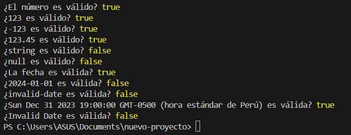

# Proyecto1: Desarrollo de una librería de validación de datos en TypeScript


## Descripción

Esta librería modular y reusable permite la validación de datos de entrada en aplicaciones. Soporta diferentes tipos de validaciones como números, cadenas, fechas y objetos, aplicando principios de diseño (SOLID), sólidos para garantizar su eficacia y facilidad de uso y patrones de diseño como Strategy y Factory.

## Requisitos

- Aplicar principios SOLID y patrones de diseño como Strategy y Factory.
- Utilizar genéricos y utilitarios de tipo en TypeScript para tipar las validaciones.
- Documentar el código utilizando estándares como JSDoc o TypeDoc.
- Implementar pruebas unitarias exhaustivas con Jest siguiendo TDD.
- Gestionar el proyecto utilizando Git y seguir prácticas de branching.

## Estructura del Proyecto

```
projecto1_sistemas_web/
|
│── dist/
├── libreria/
│   ├── validacion/
│   │   ├── numberValidacion.ts
│   │   ├── stringValiddacion.ts
│   │   |── dateValidacion.ts
│   │   └── objectValidacion.ts
│   ├── strategy/
│   │   |── validacionFactory.ts
|   |   └── validacionStrategy.ts
│   |── index.ts
│   
│
├── tests/
│   ├── numberValidacion.test.ts
│   ├── stringValidacion.test.ts
│   └── dateValidacion.test.ts
│   └── objectValidacion.test.ts
│   └── validacionFactory.test.ts
│   └── validacionStrategy.test.ts
│
├── package.json
├── package-lock.json
├── jest.config.js
├── jest.config.ts
├── tsconfig.json
└── README.md


```
**Utilizacion de los principos SOLID**

- Single Responsibility Principle (SRP): Cada clase de validación tiene una única responsabilidad, lo que facilita su mantenimiento y pruebas.
- Open/Closed Principle (OCP): La librería está diseñada para ser extensible sin modificar el código existente, permitiendo agregar nuevas validaciones fácilmente.
- Liskov Substitution Principle (LSP): Se garantiza que las subclases de validación puedan sustituir a las clases base sin alterar la funcionalidad de la librería.
- Interface Segregation Principle (ISP): Se utilizan interfaces específicas para cada tipo de validación, lo que evita que los consumidores de la librería dependan de métodos que no utilizan.
- Dependency Inversion Principle (DIP): Las dependencias de la librería se gestionan basada en interfaz. Mejorando la flexiblidad.

**Uso de patrones de diseño:**

**Strategy:** Permite seleccionar dinámicamente tipos de validación que se utilizará, facilitando la adición de nuevas validaciones sin afectar las existentes.

**Factory:** Se emplea para instanciar las diferentes clases de validación, simplificando la creación y gestión de los tipos de validación.

## Desarrollo Guiado por Pruebas (TDD)

### Cómo se aplica TDD en este proyecto

En este proyecto de **librería de validación de datos en TypeScript**, se a seguido los principios de TDD en cada etapa del desarrollo. A continuación se detalla el proceso seguido:

1. **Escribir una prueba**: Antes de desarrollar una nueva característica o funcionalidad, se redacto una prueba que defina cómo se espera que funcione dicha característica.
2. **Ejecutar la prueba**: Se ejecuta la prueba, la cual debe fallar, ya que la funcionalidad aún no está implementada. Esto verifica que la prueba sea válida.
3. **Implementar la funcionalidad**: Se desarrolla el código necesario para hacer que la prueba pase. 
4. **Ejecutar las pruebas**: Se vuelve a ejecutar las pruebas para asegurar de que la nueva funcionalidad cumple con las expectativas y no ha haya fallado en  ninguna funcionalidad existente.

5. **Refactorizar la implementación existente**: Se realiza mejoras al codigo de forma que sea más eficiente, con codigo más descriptivo o más rapido.


### Ejemplo de aplicación de TDD:

1. **Prueba**:

```
   //validación de números mayores a un valor dado
    test('Debe validar un número mayor que un valor dado', () => {
        const validacion = new MayorQueNumberValidacion(10);
        expect(validacion.validar(20)).toBe(true);
        expect(validacion.validar(5)).toBe(false);
    });
```
Al ejecutar esta prueba fallará porque aún no se implemento:


2. **Implementamos la funcionalidad:** 

```
export class MayorQueNumberValidacion implements ValidacionStrategy<number> {
    private minValue: number;
  
    constructor(minValue: number) {
      this.minValue = minValue;
    }
    
    /**
     * Valida si el número es mayor que el numero dado.
     * @param {number} value - El número mayor que un numero dado miniValue.
     * @returns {boolean} True si el número es mayor, False en caso contrario.
     */

    validar(value: number): boolean {
      return value > this.minValue;
    }
}
```
## **Ejecución:**

Al ejecutar las pruebas nuevamente:


### **Otras interacciones con el RGR de TDD**

1. DatePasadaValidacion

Fase Roja: Se escribe una prueba DatePasadaValidacion, al ejecutar saldra el mensaje de error.


Fase Verde: Implementamos una solución sin procuparse por la optimización, lo importante es poder pasar la prueba. Obteniendo pasar prueba.


Fase Refactor: Refactorizamos el codigo implementado para optimizar.


Resultado:


2. LongitudStringValidacion

Fase Roja: Se escribe una prueba LongitudStringValidacion, al ejecutar saldra el mensaje de error.


Fase Verde: Implementamos una solución sin procuparse por la optimización, lo importante es poder pasar la prueba. Obteniendo pasar prueba.


Fase Refactor: Refactorizamos el codigo implementado para optimizar.


Resultado:


3. ObjetoCampoValidacion

Fase Roja: Se escribe una prueba ObjetoCampoValidacion, al ejecutar saldra el mensaje de error.


Fase Verde: Implementamos una solución sin procuparse por la optimización, lo importante es poder pasar la prueba. Obteniendo pasar prueba.


Fase Refactor: Refactorizamos el codigo implementado para optimizar.


Resultado:


4. 

Fase Roja: Se escribe una prueba ObjetoCampoValidacion, al ejecutar saldra el mensaje de error.


Fase Verde: Implementamos una solución sin procuparse por la optimización, lo importante es poder pasar la prueba. Obteniendo pasar prueba.


Fase Refactor: Refactorizamos el codigo implementado para optimizar.


Resultado:


### **Para ejecutar las pruebas unitarias implementadas con Jest**

1.-Asegúrate de que las dependencias estén instaladas.

Crea un nuevo proyecto

```
npm init
```
Instala TypeScript como una dependencia de desarrollo:

```
npm install --save-dev typescript
```
Inicializa TypeScript para crear un archivo de configuración tsconfig.json:

```
npx tsc --init
```
Edita tsconfig.json según tus necesidades. 

**Instalacion de jest**

Instala Jest como una dependencia de desarrollo:

```
npm install --save-dev jest @types/jest ts-jest
```
Crea un archivo de configuración de Jest: 
jest.config.js

Agrega scripts en package.json:

```
"scripts": {
  "test": "jest"
}
```

2.-Ejecuta el comando:

```
npm test
```

**Publicacion de la libreria en npm**

1. Tienes una cuenta en npm
2. Iniciar sesión en npm: npm login
3. Publicar la librería: npm publish
4. Ejecutar la Librería:
```
npm install proyecto-libreria-validacion-e
```
5. Usarlo en el codigo:

Ejemplo de implementación:

```
import { NumberValidacion} from 'proyecto-libreria-validacion-e/dist/validacion/numberValidacion.js'
import {DateValidacion} from 'proyecto-libreria-validacion-e/dist/validacion/dateValidacion.js'
// Ejemplo de uso de la  validación de números
const esNumeroValido = new NumberValidacion();
const validarnumero=esNumeroValido.validar(123)
console.log('¿El número es válido?', validarnumero);


// Validación de más números
const numeroPruebas = [123, -123, 123.45, 'string', null];
numeroPruebas.forEach(num => {
    console.log(`¿${num} es válido?`, esNumeroValido.validar(num));
});

// Ejemplo de uso de la validación de fechas
const esFechaValida = new DateValidacion();
const validarfecha=esFechaValida.validar(new Date('2024-01-01'))
console.log('¿La fecha es válida?', validarfecha);

```

Como resultado se obtiene:

